# AWS Cloud Security Builder — สร้างและปกป้องระบบคลาวด์อย่างไรให้ปลอดภัย 100%

  

บทความนี้จัดทำขึ้นในรูปแบบของ **Technical Writeup** เพื่อสรุปและทบทวนขั้นตอนการปฏิบัติงานจากโปรเจกต์ **AWS Cloud Security** โดยมีเป้าหมายในการลงมือปฏิบัติจริง (Hands-On Implementation)

  

ในยุคที่หลายบริษัทต่างย้ายโครงสร้างพื้นฐานและข้อมูลสำคัญขึ้นสู่ระบบคลาวด์ ภัยคุกคามทางไซเบอร์ก็พัฒนารูปแบบตามไปด้วยเหมือนเงา การพึ่งพาเพียงแค่ฟีเจอร์พื้นฐานของระบบอาจไม่เพียงพออีกต่อไป สิ่งสำคัญที่วิศวกรความปลอดภัย (Security Engineer) ต้องตระหนักถึงคือหลักการ **Shared Responsibility Model** ที่ผู้ใช้งานคลาวด์มีหน้าที่รับผิดชอบและต้องเป็นผู้ออกแบบการควบคุมความปลอดภัย "ใน" ระบบคลาวด์ ด้วยตนเอง

  

เนื้อหาภายในบทความนี้จะพาไปเจาะลึกสถาปัตยกรรมความปลอดภัยทั้ง 4 เฟสหลัก ได้แก่:

  

1.  **Securing Data in Amazon S3:** การจำกัดสิทธิ์ระดับ Least Privilege และปกป้องข้อมูล PII

2.  **Securing VPCs:** การตั้งค่าเครือข่าย ป้องกันการเข้าถึงด้วย Network ACLs, Security Groups และ Network Firewall

3.  **AWS KMS & Envelope Encryption:** การบริหารจัดการกุญแจเข้ารหัสเพื่อปกป้องข้อมูลที่จัดเก็บ (Data-at-Rest)

4.  **Monitoring Cloud Resources:** การสร้างระบบเฝ้าระวังอัตโนมัติด้วย CloudTrail, CloudWatch และแจ้งเตือนผ่าน SNS

  

---

  

## Phase 1: Securing Data in Amazon S3 (การปกป้องข้อมูลระดับ Storage)

  

**"คุณจะมั่นใจได้อย่างไรว่า ข้อมูลความลับของลูกค้า จะไม่ถูกเข้าถึงโดยบุคคลที่ไม่เกี่ยวข้อง แม้คนๆ นั้นจะอยู่ในเครือข่ายองค์กรเดียวกันก็ตาม?"**

  

เป้าหมายในเฟสที่ 1 นี้ เราจะมาเรียนรู้วิธีการอุดช่องโหว่ดังกล่าว ด้วยการใช้หลักการ **Least Privilege (การให้สิทธิ์เท่าที่จำเป็น)** เราจะมาดูวิธีการเขียน Bucket Policy เพื่อล็อกเป้าหมายให้เฉพาะผู้ใช้ที่มีสิทธิ์เท่านั้นที่เข้าถึงไฟล์ได้ พร้อมทั้งเปิดระบบ Versioning และ Logging เพื่อบันทึกทุกร่องรอยการเข้าใช้งาน

  

### Requirements (สิ่งที่เตรียมไว้ให้)

-  **AWS Account:** ที่มีสิทธิ์เข้าถึงในบทบาทโครงสร้างหลัก `voclabs`

-  **บัญชีผู้ใช้งานทดสอบ (IAM Users):** ได้แก่ `paulo` (ผู้จัดการบัญชีที่มีสิทธิ์สูง) และ `mary` (ผู้จัดการบัญชีทั่วไป) เพื่อใช้ในขั้นตอนการพิสูจน์สิทธิ์

-  **ถังเก็บข้อมูลส่วนกลางสำหรับบันทึกประวัติ:** ได้แก่ถังที่ลงท้ายด้วย `s3-objects-access-log` และ `s3-inventory` ที่ระบบสร้างไว้รอรับข้อมูล

  

### Steps

#### 1. สร้างถังเก็บข้อมูลพร้อมทั้งสร้าง Bucket Policy

-  **1.1** เข้าสู่ระบบด้วยบทบาทหลัก `voclabs` ไปที่หน้าต่างควบคุม Amazon S3 ทำการสร้างถังเก็บข้อมูลใหม่

-  **1.2** อัปโหลดไฟล์ข้อความทดสอบชื่อ `myfile.txt` ที่มีข้อความด้านในว่า `hello world` ขึ้นไปเก็บไว้

-  **1.3** ไปที่แถบความปลอดภัย (Permissions) ของถังเก็บข้อมูลนี้ นำรหัสโครงสร้างนโยบาย (JSON) ไปวางเพื่อกำหนดสิทธิ์อย่างเข้มงวด โดยนโยบายนี้จะระบุอย่างชัดเจนว่า **อนุญาต** ให้เฉพาะบทบาท `voclabs` ผู้ใช้ `paulo` และผู้ใช้ `sofia` เท่านั้นที่มีสิทธิ์จัดการข้อมูล ส่วนผู้ใช้อื่นๆ นอกเหนือจากนี้ (รวมถึง `mary`) จะถูก **ปฏิเสธ (Deny)** การเข้าถึงโดยสิ้นเชิงในทุกกรณี

  

#### 2. การทดสอบระบบสิทธิ์ผู้ใช้งาน

-  **2.1** เข้าสู่ระบบด้วยผู้ใช้ `paulo`: สามารถกดเข้าไปเปิดดูถังเก็บข้อมูล `data-bucket` และดาวน์โหลดไฟล์ `myfile.txt` ได้สำเร็จ แต่เมื่อกดไปที่ถังเก็บข้อมูลใบอื่นในระบบ จะขึ้นข้อความปฏิเสธการเข้าถึง

-  **2.2** เข้าสู่ระบบด้วยผู้ใช้ `mary`: เมื่อกดเข้ามาที่หน้าบริการจะพบสถานะแจ้งเตือนข้อผิดพลาด (Error) บนถังเก็บข้อมูล `data-bucket` และเมื่อพยายามกดเข้าไปดูรายชื่อไฟล์ด้านใน จะถูกระบบบล็อคพร้อมแสดงข้อความ *"Insufficient permissions"* ทันที

  

#### 3. เปิดระบบป้องกันข้อมูลและบันทึกประวัติฝั่งเซิร์ฟเวอร์

-  **3.1** กลับมาที่บทบาทหลัก `voclabs` เข้าไปที่แถบคุณสมบัติ (Properties) ของถังเก็บข้อมูล `data-bucket` จากนั้นกดเปิดใช้งาน **Bucket Versioning** เพื่อให้ระบบจดจำประวัติและรักษารุ่นของไฟล์ทุกครั้งที่มีการแก้ไขหรือลบข้อมูล

-  **3.2** ในแถบคุณสมบัติเดียวกัน มองหาหัวข้อ **Server access logging** กดเปิดใช้งานและกำหนดให้ส่งประวัติการใช้งานทั้งหมดไปเก็บไว้ที่ถังเก็บข้อมูล `s3-objects-access-log-[รหัสเฉพาะ]` โดยใส่โครงสร้างเส้นทางส่วนท้ายเป็น `/data-bucket` เพื่อจัดระเบียบข้อมูล

  

#### 4. วิเคราะห์แกะรอยประวัติด้วย Amazon Athena

- ไปที่หน้าต่างควบคุม Amazon Athena เพื่อดูพฤติกรรมเฉพาะของผู้ใช้ในระบบคลาวด์

  

### Conclusion & Future Work

**Key Takeaways**

-  **Multi-layered Permissions:** ทุกคนสังเกตเห็นอะไรไหมครับ? การควบคุมสิทธิ์ที่แท้จริงบน AWS ไม่ได้จบแค่การตั้ง IAM Policy ให้กับ User เท่านั้น แต่คีย์เวิร์ดสำคัญคือการใช้ Bucket Policy มาล็อกฝั่งทรัพยากรซ้อนเข้าไปอีกชั้น ซึ่งนี่แหละครับคือวิธีการสร้างด่านป้องกันที่เหนียวแน่นและเจาะจงที่สุด

-  **จาก Log ที่อ่านยาก สู่ Insight ที่ใช้งานได้จริง:** ลองจินตนาการถึงการต้องมานั่งงมหาข้อมูลในไฟล์ Log ที่ยาวเป็นหางว่าวดูสิครับ... แต่ปัญหานั้นจะหมดไปทันทีเมื่อเราใช้ Amazon Athena เข้ามาช่วยค้นหา มันช่วยเปลี่ยนข้อมูลดิบๆ ให้กลายเป็นข้อมูลเชิงลึกที่มีมูลค่า ทำให้คนดูแลระบบสามารถรันคำสั่งเช็กความผิดปกติได้เสร็จภายในเวลาแค่ไม่กี่วินาที!

  

**Real-world Application & Examples**

-  **ตัวอย่างการใช้งานจริง:** การจัดเก็บไฟล์เอกสารสำคัญของลูกค้าธนาคาร (เช่น สำเนาบัตรประชาชน) เราสามารถนำโครงสร้างนโยบายจากแล็บนี้ไปใช้ล็อคถังเก็บข้อมูลเอกสารสมัครสินเชื่อของธนาคาร โดยตั้งค่าให้เฉพาะระบบแอปพลิเคชันหลักและเจ้าหน้าที่ฝ่ายพิจารณาสินเชื่อที่เกี่ยวข้องเท่านั้นที่มีสิทธิ์เปิดอ่านไฟล์ ส่วนพนักงานฝ่ายอื่นๆ จะไม่สามารถเข้าถึงได้เลย แม้จะอยู่ในระบบเครือข่ายเดียวกันก็ตาม

  

---

  

## Phase 2: Securing VPCs (การสร้างป้อมปราการเครือข่ายแบบ Defense-in-Depth)

  

**"คุณจะรู้ตัวได้อย่างไร หากมีใครบางคนกำลังแอบสแกนพอร์ต (Port Scanning) เพื่อหาช่องโหว่เจาะเข้าเซิร์ฟเวอร์ของคุณจากระยะไกล?"**

  

เป้าหมายในเฟสที่ 2 นี้ เราจะไม่ยอมพึ่งพากำแพงเพียงชั้นเดียวครับ แต่เราจะมาสร้างระบบเครือข่ายที่ทนทานต่อการโจมตี (Resistant to Penetration Testing) โดยเริ่มตั้งแต่การเปิด "กล้องวงจรปิด" ให้เครือข่ายด้วย **VPC Flow Logs** เพื่อบันทึกทุกการเคลื่อนไหว จากนั้นเราจะผสานการทำงานระหว่างกำแพงแบบ Stateful (**Security Groups**) และ Stateless (**Network ACLs**) เข้าด้วยกัน

  

และทีเด็ดของเฟสนี้คือ การติดตั้ง **AWS Network Firewall** เพื่อคัดกรองแพ็กเก็ตข้อมูลแปลกปลอมและทำลายทิ้งตั้งแต่ก่อนจะเข้าถึงเครือข่ายภายใน ลองมาดูกันครับว่า การตั้งค่าเครือข่ายให้ปลอดภัยระดับองค์กรเขาทำกันอย่างไร...

  

### Requirements (สิ่งที่เตรียมไว้ให้)

-  **AWS Account:** (Vocareum Lab) ที่สิทธิ์เข้าถึงในบทบาท `voclabs`

-  **LabVPC:** ระบบเครือข่ายเดิมที่มี WebServerSubnet และเครื่อง WebServer (EC2 Instance) รันอยู่ภายใน

-  **NetworkFirewallVPC:** ระบบเครือข่ายชุดที่สองที่เตรียมไว้สำหรับทดสอบระบบกำแพงไฟขั้นสูง

-  **Internet Gateway (IGW):** ที่เชื่อมต่อกับ VPC อยู่แล้ว แต่ยังไม่ได้ผูกเส้นทาง

  

### Steps

#### 1. ตรวจสอบทรัพยากรเดิมและเก็บบันทึกประวัติ

-  **1.1** เข้าไปที่หน้าต่างควบคุม Amazon VPC (ภูมิภาค us-east-1) เพื่อตรวจสอบแผนผังเครือข่ายของ LabVPC พบว่า WebServerSubnet ยังไม่มีเส้นทาง (Route) ชี้ไปยัง Internet Gateway

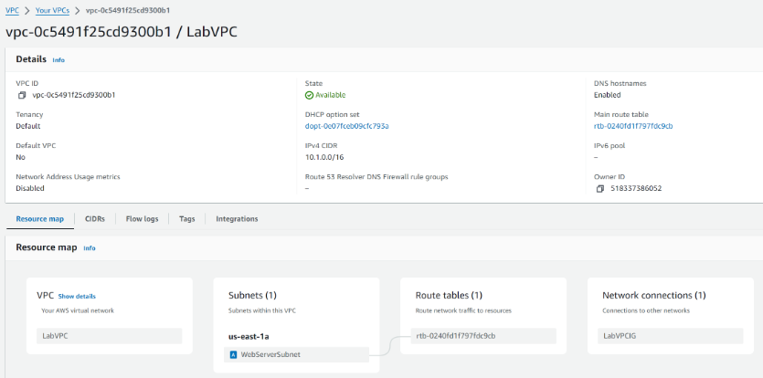

-  **1.2** ทำการเปิดระบบบันทึกประวัติโดยเลือกที่ LabVPC กดสร้าง Flow Logs ตั้งชื่อว่า `LabVPCFlowLogs` กำหนดให้ส่งข้อมูลไปยัง CloudWatch Logs กลุ่มชื่อ `LabVPCFlowLogs` โดยตั้งค่าเวลาสรุปข้อมูลทุกๆ 1 นาที

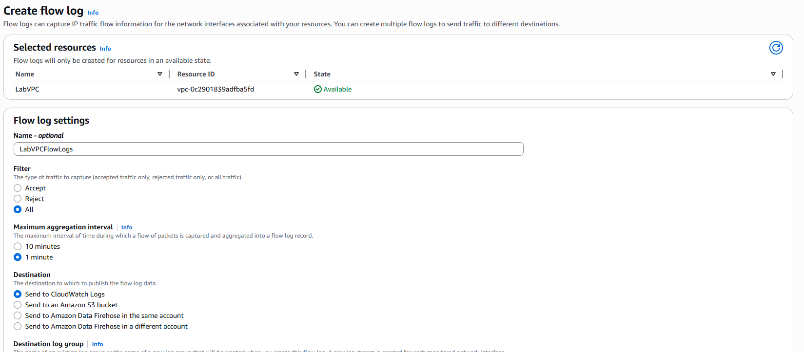

  

#### 2. แก้ไข Route Tables

-  **2.1** ไปที่หัวข้อ Route Tables เลือกตารางที่ผูกอยู่กับ WebServerSubnet

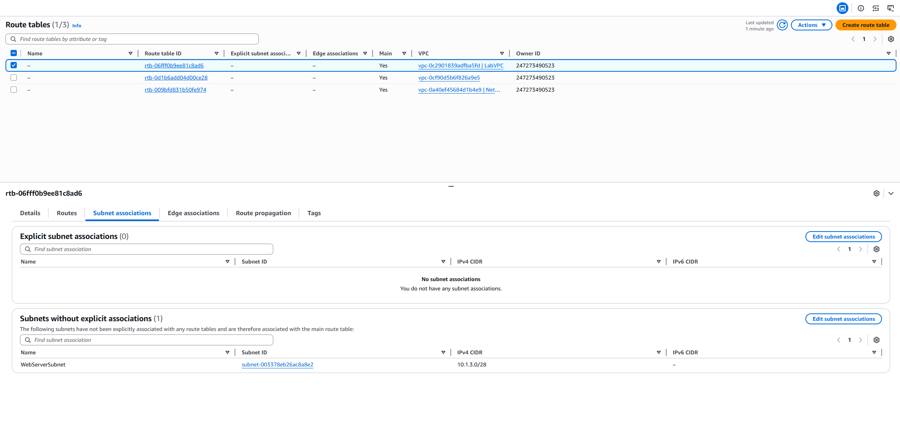

-  **2.2** กด Edit routes เพิ่มเส้นทางใหม่เป็น ปลายทาง (Destination): `0.0.0.0/0` และ เป้าหมาย (Target): เลือก Internet Gateway (IGW) ของระบบ เพื่อเปิดให้อินเทอร์เน็ตวิ่งเข้า-ออกได้

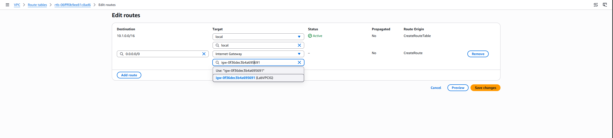

  

#### 3. จำกัดสิทธิ์ด้วย Security Groups แบบ Stateful

-  **3.1** ไปที่ Amazon EC2 คัดลอก Public IP ของ WebServer ไว้ จากนั้นไปที่กลุ่มความปลอดภัย (Security Group) ของเครื่องนี้

-  **3.2** ลบกฎเดิมที่เปิดกว้างเกินไปออก และเพิ่มกฎขาเข้า (Inbound Rules) ใหม่ 3 ข้อ:

-  **HTTP (Port 80):** แหล่งที่มา `0.0.0.0/0` (เพื่อให้คนทั่วไปเข้าชมเว็บได้)

-  **SSH (Port 22):** แหล่งที่มา `My IP` (ล็อคให้เฉพาะไอพีเครื่องคอมพิวเตอร์ของเราเข้าควบคุมได้)

-  **SSH (Port 22):** แหล่งที่มาเป็นช่วงไอพีของระบบเชื่อมต่อตรง (EC2 Instance Connect) เพื่อให้กด Connect จากหน้าเว็บ AWS ได้อย่างปลอดภัย

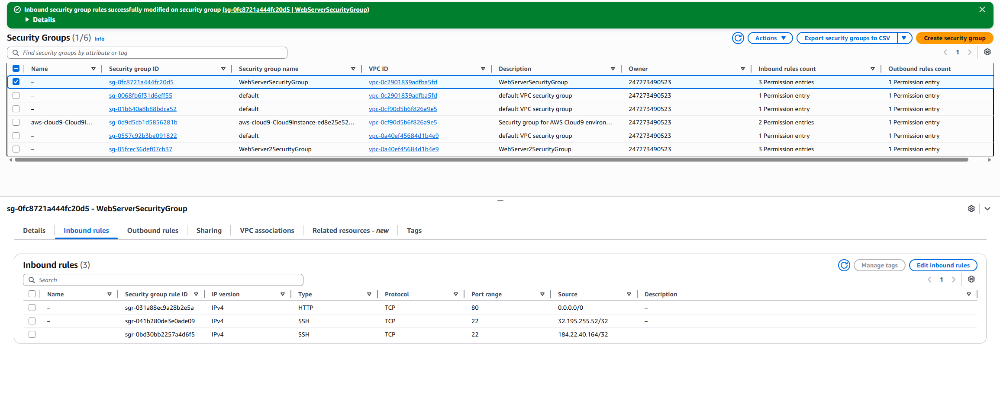

  

#### 4. เพิ่ม Network ACLs (Stateless)

-  **4.1** ไปที่หัวข้อ Network ACLs ของ LabVPC ทดสอบปรับกฎขาเข้าหมายเลข 100 ให้เป็น `DENY` แล้วลองรีเฟรชหน้าเว็บ ผลปรากฏว่าหน้าเว็บเข้าไม่ได้ทันที (เป็นการพิสูจน์ว่า NACLs ตัดข้อมูลก่อนไปถึง Security Group)

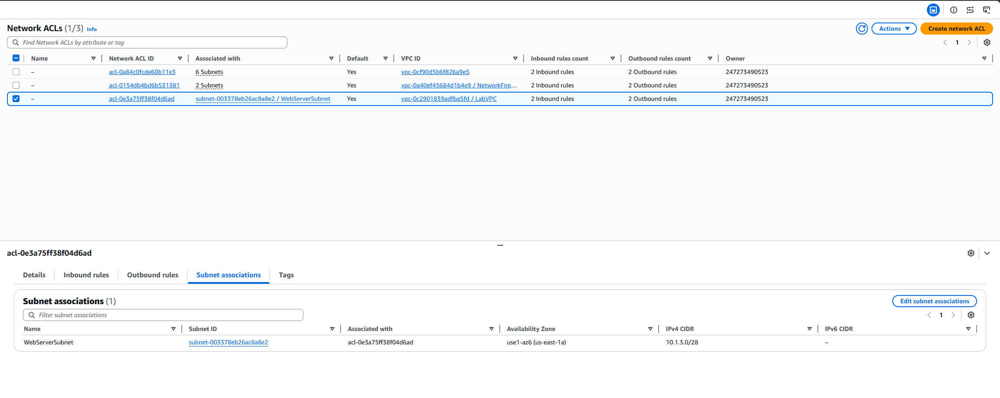

-  **4.2** ปรับตั้งค่ากฎที่ถูกต้องเพื่อให้ใช้งานได้ปลอดภัย:

-  **Rule 90:** เปิดพอร์ต 80 (HTTP) จากทุกที่

-  **Rule 100:** เปิดพอร์ต 22 (SSH) จากกลุ่มผู้ดูแลระบบ

-  *หมายเหตุ: อย่าลืมเปิดพอร์ตขากลับ (Ephemeral Ports) ในกฎขาออก (Outbound Rules) ด้วย เนื่องจาก NACLs เป็น Stateless*

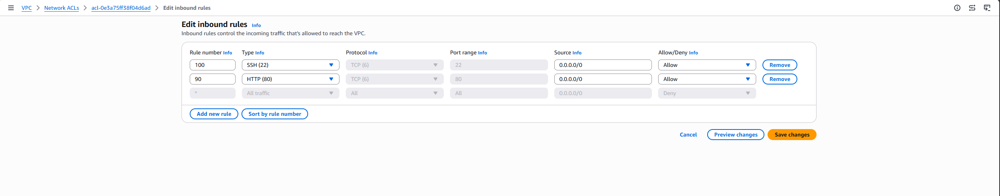

  

#### 5. ติดตั้ง AWS Network Firewall

-  **5.1** ไปที่เครือข่าย NetworkFirewallVPC สร้างระบบกำแพงไฟชื่อ `NetworkFirewall` ผูกเข้ากับ Subnet ที่เตรียมไว้

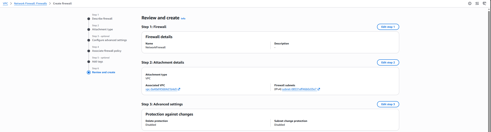

-  **5.2** จัดการสร้าง Route Tables ใหม่ 3 ชุด เพื่อบังคับทิศทางข้อมูล (Traffic Redirection) ให้ข้อมูลที่วิ่งจาก Internet Gateway ต้องวิ่งเข้ามาที่ Endpoint ของ Network Firewall ก่อน แล้วจึงจะส่งต่อไปยังเครื่อง WebServer ได้


-  **5.3** สร้างกลุ่มกฎระเบียบแบบ Stateful Rule Group โดยใช้เกณฑ์คัดกรอง 5 ข้อ (บล็อคพอร์ต 8080 และอนุญาตพอร์ต 80, 22, 443, ICMP)


  

### Conclusion & Future Work

**Key Takeaways**

-  **Security Group vs. Network ACLs:** ทุกคนสังเกตเห็นความน่าสนใจของการใช้กำแพงสองชั้นนี้ไหมครับ? หัวใจสำคัญคือการที่เราต้องเข้าใจอย่างลึกซึ้งว่า Security Group นั้นทำหน้าที่ปกป้องด่านในระดับ Instance (แถมยังฉลาดพอที่จะเป็น Stateful จำสถานะขาเข้าได้โดยไม่ต้องตั้งค่าขาออกซ้ำ) ตัดสลับกับ Network ACLs ที่เป็นด่านนอกคอยคุมระดับ Subnet (แบบ Stateless ที่ต้องเช็กละเอียดทั้งขาเข้าและออก) ลองคิดดูสิครับว่า ถ้าเราดึงจุดเด่นของทั้งสองตัวนี้มาใช้งานร่วมกัน มันจะสร้างปราการเครือข่ายที่หนาแน่นและเจาะทะลุได้ยากขนาดไหน!

-  **พลังของระบบบันทึก (Logging):** ถ้าเครือข่ายโดนสแกนหาช่องโหว่ เราจะรู้ตัวได้ยังไงถ้าไม่มีตาคอยสอดส่อง? นี่แหละครับคือคำตอบว่าทำไมการเปิด VPC Flow Logs ถึงขาดไม่ได้ ทำให้ผู้ดูแลระบบอย่างเราๆ มองเห็นพฤติกรรมแปลกปลอมหรือทราฟฟิกที่ไม่พึงประสงค์ในเครือข่ายได้อย่างรวดเร็วและจัดการได้ทันท่วงที

-  **AWS Network Firewall ในโลกความเป็นจริง:** รู้หรือไม่ครับว่าองค์กรใหญ่ๆ เขารับมือกับแพ็กเก็ตข้อมูลมหาศาลกันยังไง? เทคนิคสำคัญที่ซ่อนอยู่ในเฟสนี้คือการทำ Traffic Redirection ครับ! เป็นการวางกลยุทธ์บังคับให้ข้อมูลทุกเส้นทางต้องวิ่งผ่านด่านตรวจกลางอย่าง Network Firewall ก่อนเสมอ ซึ่งนี่ไม่ใช่แค่ทฤษฎีในห้องเรียน แต่เป็นเทคนิคระดับโปรที่ใช้กันจริงในสถาปัตยกรรมระดับ Enterprise เลยครับ

  

**Real-world Application & Examples**

-  **ตัวอย่างการใช้งานจริง:** การปกป้องระบบชำระเงิน (Payment Gateway) เราสามารถนำความรู้เรื่อง Network ACLs และ Security Group ไปใช้ล็อคพอร์ตและหมายเลขไอพีของเซิร์ฟเวอร์ที่ทำหน้าที่ตัดเงิน โดยอนุญาตให้เฉพาะไอพีของแอปพลิเคชันหลักฝั่งบ้านเรา (Internal API) เท่านั้นที่เชื่อมต่อเข้ามาได้ และบล็อคไอพีแปลกปลอมอื่นๆ ทั้งหมดตั้งแต่ระดับนอกสุด

  

---

  

## Phase 3: Securing AWS Resources by Using AWS KMS (การปกป้องข้อมูลด้วยการเข้ารหัสขั้นสูง)

  

**"หากแฮกเกอร์สามารถเจาะทะลุกำแพงเครือข่ายเข้ามาถึงเซิร์ฟเวอร์ของคุณได้สำเร็จ... คุณจะทำอย่างไรไม่ให้พวกเขา 'อ่าน' ข้อมูลความลับเหล่านั้นได้เลย?"**

  

เป้าหมายในเฟสที่ 3 นี้ เราจะมายกระดับความปลอดภัยของข้อมูลที่จัดเก็บอยู่ (Data-at-Rest Encryption) ด้วยบริการ **AWS Key Management Service (KMS)** เราจะมาออกแบบสิทธิ์การใช้งานกุญแจแบบแยกส่วนหน้าที่ (Separation of Duties) ระหว่าง "ผู้ดูแลระบบ" และ "ผู้ใช้งานข้อมูล" ออกจากกันอย่างเด็ดขาด

  

ไฮไลต์ของเฟสนี้คือการลงมือทำ **Envelope Encryption** ซึ่งเป็นเทคนิคการเข้ารหัสซ้อนเข้ารหัสที่นิยมใช้ในอุตสาหกรรมระดับโลก และการนำ **AWS Secrets Manager** มาใช้เพื่อบอกลาการฝังรหัสผ่านลงในโค้ดแบบเดิมๆ

  

มาดูกันครับว่า การปกป้องข้อมูลขั้นสุดที่แม้แต่แอดมินระบบก็ยังแอบดูไฟล์ไม่ได้... เขาตั้งค่ากันอย่างไร?

  

### Requirements (สิ่งที่เตรียมไว้ให้)

-  **บทบาทหลักผู้ดูแลระบบ:** บทบาท `voclabs` สำหรับใช้สร้างกุญแจและกำหนดนโยบาย

-  **บัญชีผู้ใช้งานทดสอบ:** บัญชี `sofia` (นักวิเคราะห์การเงิน) ซึ่งจะเป็นผู้ใช้งานหลักที่มีสิทธิ์ใช้กุญแจ และบัญชี `paulo` สำหรับใช้ทดสอบการถูกจำกัดสิทธิ์

-  **โครงสร้างพื้นฐานเดิม:** เครื่องแม่ข่ายเว็บ `WebServer2` และเครือข่าย `NetworkFirewallVPC` จากเฟสที่สอง

  

### Steps

### 1. สร้างกุญแจจัดการเองและตั้งค่าหมุนเวียนกุญแจอัตโนมัติ

**1.1** สร้างคีย์ (Customer Managed Key):

  

- สร้างคีย์ AWS KMS ประเภท Customer managed key ขึ้นมาใหม่ โดยตั้งชื่อนามแฝง (Alias) ว่า MyKMSKey

  

- ให้คงการตั้งค่าเริ่มต้น (Default settings) อื่นๆ ทั้งหมดไว้ ยกเว้นในขั้นตอนการกำหนดสิทธิ์ (Key permissions) ให้ทำการเลือกบทบาท (Role) ที่ชื่อว่า voclabs ให้ได้รับทั้งสิทธิ์ Key administrator (ผู้ดูแลระบบคีย์) และสิทธิ์ Key user (ผู้ใช้คีย์)


**1.2** ตั้งค่าการหมุนเวียนคีย์ (Key Rotation):

  

- ตั้งค่าฟังก์ชัน AWS KMS key rotation บนคีย์ใหม่ที่คุณเพิ่งสร้างขึ้นนี้ เพื่อกำหนดให้ระบบเปิดใช้งานการหมุนเวียนคีย์โดยอัตโนมัติในทุกๆ ปี (Every year)


### 2. อัปเดต Key Policy และวิเคราะห์สิทธิ์ผู้ใช้งาน

**2.1** แก้ไข Key Policy สำหรับ MyKMSKey:

- แก้ไขนโยบายของคีย์ MyKMSKey เพื่ออนุญาตให้ IAM User ที่ชื่อ sofia สามารถใช้งานคีย์นี้ได้

- คำแนะนำ (Tip): ใน Key Policy เดิมที่มีอยู่แล้ว จะมี Statement ตัวหนึ่งที่มีค่า Statement ID (Sid) เป็น "Allow use of the key" ให้คุณเพิ่ม Principal (ผู้ได้รับสิทธิ์) เข้าไปใน Statement นี้ เพื่อให้รองรับทั้ง IAM Role voclabs และ IAM User sofia
หลังจากแก้ไขแล้ว โค้ดในส่วนของโครงสร้าง Principal {} ควรจะหน้าตาเป็นแบบนี้ (โดยที่ ACCOUNT-NUMBER จะเป็นหมายเลขบัญชี AWS จริงๆ ของแล็บคุณ):

		

		"AWS": [

		arn:aws:iam::ACCOUNT-NUMBER:role/voclabs",

		"arn:aws:iam::ACCOUNT-NUMBER:user/sofia"

		]

 **2.2** วิเคราะห์ IAM Policy ที่ชื่อ PolicyForFinancialAdvisors:

ให้ทำการตรวจสอบและวิเคราะห์นโยบาย IAM ที่ชื่อ **PolicyForFinancialAdvisors** ที่มีอยู่ในระบบ


-   **ผลการวิเคราะห์ (Analysis):** นโยบายนี้ให้สิทธิ์ควบคุมอย่างเต็มที่ (Full Control) กับ S3 Buckets ทั้งหมดภายในบัญชี และให้สิทธิ์ในการเข้ารหัส (Encrypt) รวมถึงถอดรหัส (Decrypt) อ็อบเจกต์ต่างๆ ได้ ซึ่งนโยบายนี้ถูกผูกไว้กับ IAM Group ที่ชื่อ **FinancialAdvisorGroup** ซึ่งตัวผู้ใช้ `sofia` นั้นเป็นสมาชิกอยู่ในกลุ่มนี้ด้วย


### 3. ใช้ KMS เข้ารหัสข้อมูลที่จัดเก็บใน Amazon S3
**3.1** **เปลี่ยนการตั้งค่าการเข้ารหัสของ Bucket:**

-   ให้แก้ไขการตั้งค่า Encryption บน S3 bucket ที่ชื่อ `data-bucket` (ที่คุณสร้างไว้ในเฟส 1) เพื่อให้ Bucket นี้บังคับใช้การเข้ารหัสแบบ **SSE-KMS** (Server-Side Encryptionด้วย AWS KMS) โดยเลือกใช้คีย์ที่สร้างไว้ก่อนหน้านี้

**3.2** **สร้างไฟล์ทดสอบบนคอมพิวเตอร์ของคุณ:**

-   เปิด Text Editor (เช่น Notepad, VS Code) บนคอมพิวเตอร์ของคุณ แล้วสร้างไฟล์ใหม่ชื่อ `loan-data.csv`
    
-   คัดลอกข้อมูลด้านล่างนี้ไปวางในไฟล์แล้วกดบันทึก (Save):

		date,description,amount,principal,interest
		2023-01-14,payment,1000.00,845.52,154.48
		2022-12-22,payment,1021.52,742.80,278.72
		2022-11-15,payment,1000.00,855.27,144.73

**3.3** **ล็อกอินเป็นผู้ใช้ `sofia` และอัปโหลดไฟล์:**

-   เปิดหน้าต่างเบราว์เซอร์แบบไม่ระบุตัวตน (Incognito / Private Window) แล้วล็อกอินเข้า AWS Management Console ในฐานะ IAM User ที่ชื่อ **sofia**
    
    -   _คำแนะนำ:_ คุณสามารถหาลิงก์สำหรับ Log-in ของ IAM User ได้จากหน้าคอนโซล IAM ในขณะที่ยังล็อกอินด้วยสิทธิ์ `voclabs` อยู่ ส่วนรหัสผ่านของ `sofia` ให้ดูที่ปุ่ม **AWS Details** ด้านบนของคำชี้แจงแล็บ
        
-   เมื่อล็อกอินสำเร็จ ให้ทำการอัปโหลดไฟล์ `loan-data.csv` เข้าไปยัง `data-bucket`
    
-   **ผลลัพธ์:** การอัปโหลดควรจะสำเร็จ (Successful)
    
-   **บทวิเคราะห์ (Analysis):** สาเหตุที่ `sofia` อัปโหลดไฟล์ได้สำเร็จ เนื่องจากเธอได้รับสิทธิ์ให้อัปโหลดอ็อบเจกต์ผ่านทาง **Bucket Policy** ของ `data-bucket` นอกจากนี้เธอยังมีสิทธิ์ผ่านทาง **IAM Policy** ในการใช้งานบริการ AWS KMS และที่สำคัญที่สุดคือ คีย์ AWS KMS ตัวที่ Bucket นี้ใช้เข้ารหัสข้อมูล มีการผูก **Key Policy** ที่อนุญาตให้ `sofia` ใช้งานคีย์ได้โดยเฉพาะ (ที่คุณตั้งค่าไว้ใน Task 3.2) เมื่อเงื่อนไขความปลอดภัยทั้ง 3 ส่วนนี้ครบถ้วน เธอจึงทำงานนี้ได้สำเร็จ


**3.4** **ตรวจสอบการเข้ารหัสของไฟล์:**

-   ในหน้าคอนโซล Amazon S3 ให้คลิกเข้าไปที่ลิงก์ของอ็อบเจกต์ `loan-data.csv` แล้วตรวจสอบการตั้งค่า Server-side encryption ของไฟล์นี้
    
-   **ผลลัพธ์:** ชนิดการเข้ารหัส (Encryption type) ของไฟล์นี้จะต้องแสดงเป็น **SSE-KMS**


**3.5** **ทดสอบเปิดไฟล์ด้วยสิทธิ์ `sofia`:**

-   ในขณะที่ยังล็อกอินเป็น `sofia` ให้ลองเปิด (Open) หรือดาวน์โหลดไฟล์ `loan-data.csv`
    
-   **ผลลัพธ์:** ต้องสามารถเปิดหรือดาวน์โหลดได้สำเร็จ

**3.6** **ทดสอบสิทธิ์ด้วยผู้ใช้ `paulo`:**

-   ให้ Sign out ผู้ใช้ `sofia` ออกจากคอนโซล แล้วล็อกอินใหม่ด้วยผู้ใช้ที่ชื่อ **paulo**
    
-   จากนั้นให้ลองเข้าไปเปิดหรือดาวน์โหลดไฟล์ `loan-data.csv` เดียวกันนั้น
    
-   **ผลลัพธ์:** การพยายามเข้าถึงไฟล์นี้**ต้องล้มเหลว (Fail / Access Denied)**
    
-   เมื่อทดสอบเสร็จเรียกว่า ให้ล็อกเอาต์และปิดแท็บเบราว์เซอร์แบบ Incognito ไปได้เลย


### 4. ใช้ KMS เข้ารหัส Root Volume ของเครื่อง EC2
**4.1** **สร้าง EC2 Instance เครื่องใหม่:**
    
   - ในขณะที่ล็อกอินด้วยสิทธิ์ **voclabs** ให้ทำการสร้าง EC2 Instance ใหม่ โดยให้คงการตั้งค่าเริ่มต้น (Default settings) ทั้งหมดไว้ **ยกเว้น** รายละเอียดดังต่อไปนี้:
        
        -   **Name (ชื่ออินสแตนซ์):** ตั้งชื่อว่า `EncryptedInstance`
            
        -   **AMI (ระบบปฏิบัติการ):** เลือก `Amazon Linux 2023 AMI`
            
        -   **Instance type (ขนาดเครื่อง):** เลือก `t3.micro`
            
        -   **Key pair (กุญแจสำหรับล็อกอิน):** เลือก `vockey`
            
        -   **Network settings (การตั้งค่าเครือข่าย):** คลิก Edit แล้วเลือกติดตั้งลงใน VPC ที่ชื่อ `NetworkFirewallVPC` และเลือก Subnet เป็น `WebServerSubnet2`
            
        -   **Security Group (กลุ่มความปลอดภัย):** เลือกใช้กลุ่มที่มีอยู่แล้ว (Existing Security Group) ชื่อ `WebServer2SecurityGroup`
            
        -   **Configure storage (การตั้งค่าพื้นที่เก็บข้อมูล):** ให้เลือกที่เมนู **Advanced** (ขั้นสูง) จากนั้นปรับการตั้งค่าเพื่อเข้ารหัส (Encrypt) ตัว AMI root volume โดยเลือกใช้คีย์ **MyKMSKey** ที่คุณสร้างไว้
            
        -   **Advanced details (รายละเอียดขั้นสูง):** ในช่อง IAM instance profile ให้เลือกเป็น `WebServerInstanceProfile`
            
-   **ตรวจสอบความถูกต้อง (Verify):**
    
    -   หลังจากสร้างเสร็จสิ้น ให้เข้าไปที่หน้าแสดงรายละเอียด (Details page) ของอินสแตนซ์ `EncryptedInstance` ที่คุณเพิ่งสร้างขึ้น
        
    -   คลิกเลือกที่แท็บ **Storage** (พื้นที่จัดเก็บข้อมูล) แล้วตรวจสอบดูว่า Root Volume ของอินสแตนซ์นี้ได้รับการเข้ารหัสเรียบร้อยแล้วหรือไม่
        
    -   **ผลลัพธ์:** ข้อมูลบนหน้าจอในแท็บ Storage ควรจะแสดงรายละเอียดคล้ายกับรูปภาพที่คุณแนบมา (ในคอลัมน์ **Encrypted** จะต้องขึ้นสถานะว่า **Yes** และช่อง **KMS key ID** จะต้องตรงกับคีย์ที่คุณเลือกใช้ครับ)


### 5. ใช้เทคนิค Envelope Encryption เพื่อเข้ารหัสข้อมูลไฟล์โดยตรง
**5.1** **ขั้นตอนการปฏิบัติและชุดคำสั่ง**
- **เชื่อมต่อเข้าเครื่อง WebServer2:**
   - ให้ใช้ระบบ **EC2 Instance Connect** เพื่อเชื่อมต่อ (SSH) เข้าไปยังเครื่อง `WebServer2`
        
-   **สร้างไฟล์ข้อมูลดิบสำหรับทดสอบ:**
    
    -   รันคำสั่งต่อไปนี้ในหน้าต่าง Terminal ของ EC2 Instance Connect เพื่อสร้างไฟล์ข้อความที่ยังไม่เข้ารหัส:
        ``` Bash
        echo "Let's encrypt these file contents. Sensitive data here." > data_unencrypted.txt
        cat data_unencrypted.txt
        
        ```
        
-   **ใช้ AWS CLI เพื่อสร้าง Data Key จาก AWS KMS คีย์ของคุณ:**
    
    -   _หมายเหตุ:_ เครื่องระบบปฏิบัติการ Amazon Linux 2023 (เช่น WebServer2) จะมีการติดตั้ง AWS CLI มาให้ล่วงหน้าอยู่แล้ว นอกจากนี้ Instance Profile (`WebServerRole`) ที่ผูกอยู่กับตัวเครื่อง ก็ได้รับสิทธิ์ AWS KMS ที่จำเป็นสำหรับงานนี้ไว้แล้วด้วย และกฎ (Stateful rule) ใน Network Firewall ที่คุณตั้งค่าไว้ก่อนหน้านี้ก็อนุญาตให้คุยผ่านพอร์ต 443 (HTTPS) ได้ ซึ่งจำเป็นต่อการเรียกใช้งาน AWS CLI  _ระบบจะแสดงรายการคีย์ KMS ทั้งหมดในบัญชีนี้ออกมารวมถึงคีย์ของคุณ_ (หากไม่มีอะไรตอบกลับมา ให้กลับไปเช็กกฎพอร์ต 443 ใน NetworkFirewallVPCRuleGroup)
        
    -   ทดสอบการเข้าถึงบริการ AWS KMS โดยรันคำสั่ง:
        ``` Bash
        aws kms list-keys
        
        ```
        
        _ระบบจะแสดงรายการคีย์ KMS ทั้งหมดในบัญชีนี้ออกมารวมถึงคีย์ของคุณ_ (หากไม่มีอะไรตอบกลับมา ให้กลับไปเช็กกฎพอร์ต 443 ใน NetworkFirewallVPCRuleGroup)
        
    -   รันคำสั่งด้านล่างนี้เพื่อสร้าง Data Key จากคีย์ `MyKMSKey` แล้วจัดรูปแบบการแสดงผลให้อ่านง่าย (Pretty JSON):
        ```  Bash
        result=$(aws kms generate-data-key --key-id alias/MyKMSKey --key-spec AES_256)
        echo $result | python3 -m json.tool
        
        ```
        
    -   **บทวิเคราะห์ (Analysis):** ผลลัพธ์ที่ได้จะมีค่าสำคัญสองตัวคือ:
        
        -   `CiphertextBlob`: คือ Data Key เวอร์ชั่นที่**ถูกเข้ารหัส**ครอบไว้ด้วยคีย์ `MyKMSKey` ตัวนี้แหละที่คุณจะเก็บไว้บนดิสก์อย่างปลอดภัยเพื่อใช้ในอนาคต
            
        -   `Plaintext`: คือ Data Key ในรูปแบบ**ข้อความดิบ (ไม่เข้ารหัส)** ที่จะเอาไปใช้สั่งเข้ารหัสไฟล์ตรงๆ ทันที


**5.2** **บันทึก Data Key ลงในเครื่อง:**

-   สกัดเอาค่า `CiphertextBlob` ออกมาแปลงจาก Base64 แล้วเซฟลงไฟล์ชื่อ `data_key_ciphertext` ด้วยคำสั่ง:
    ```Bash
    dk_cipher=$(echo $result| jq '.CiphertextBlob' | cut -d '"' -f2)
    echo $dk_cipher
    echo $dk_cipher | base64 --decode > data_key_ciphertext
    ```

-   ลองเปิดดูเนื้อหาของ Data Key ที่ถูกเข้ารหัสไว้ (มันจะอ่านไม่รู้เรื่อง):
    ```Bash
    cat data_key_ciphertext
    ```
    
-   _คำแนะนำ:_ คุณสามารถแปลงคีย์ที่ถูกล็อกไว้ตัวนี้กลับมาเป็น Plaintext เมื่อไหร่ก็ได้ตราบใดที่มีสิทธิ์ใช้ KMS ผ่านคำสั่ง `aws kms decrypt` ลองรันคำสั่งนี้เพื่อถอดรหัสออกมาเก็บไว้ใช้ชั่วคราว:
    ``` Bash
    aws kms decrypt --ciphertext-blob fileb://./data_key_ciphertext --query Plaintext --output text | 		   base64 --decode > data_key_plaintext_encrypted
    ```


**5.3** **ใช้ Data Key เข้ารหัสไฟล์ข้อมูลของคุณ:**

-   นำตัวคีย์ Plaintext ที่สกัดได้ไปเข้ารหัสไฟล์ `data_unencrypted.txt` ด้วย OpenSSL:
    

    
    ``` Bash
    openssl enc -aes-256-cbc -salt -pbkdf2 -in data_unencrypted.txt -out data_encrypted -pass file:data_key_plaintext_encrypted
    
    ```
    
-   ลองเปิดดูไฟล์ที่ถูกเข้ารหัสแล้วด้วยคำสั่งนี้ (เนื้อหาจะกลายเป็นภาษาต่างดาวอ่านไม่ออก):

    
    ``` Bash
    cat data_encrypted
    
    ```
    
-   ลบไฟล์ต้นฉบับที่ไม่ได้เข้ารหัสทิ้งไปเพื่อความปลอดภัย:
    

    
    ``` Bash
    rm data_unencrypted.txt
    
    ```
    
-   **บทวิเคราะห์ (Analysis):** มาถึงตรงนี้คุณได้เรียนรู้วิธีการสร้างคีย์สำหรับเข้ารหัสข้อมูล (Data Key) เก็บมันไว้ในรูปแบบที่ปลอดภัย ปิดผนึกไฟล์เป้าหมายเรียบร้อย และทำลายไฟล์ต้นฉบับทิ้ง ขั้นตอนต่อไปคือการทดลองกู้คืนข้อมูลกลับมา


**5.4** **ใช้ Data Key เข้ารหัสไฟล์ข้อมูลของคุณ:**
    
   -   นำตัวคีย์ Plaintext ที่สกัดได้ไปเข้ารหัสไฟล์ `data_unencrypted.txt` ด้วย OpenSSL:
        
      
        
        ```  Bash
        openssl enc -aes-256-cbc -salt -pbkdf2 -in data_unencrypted.txt -out data_encrypted -pass file:data_key_plaintext_encrypted
        
        ```
        
    -   ลองเปิดดูไฟล์ที่ถูกเข้ารหัสแล้วด้วยคำสั่งนี้ (เนื้อหาจะกลายเป็นภาษาต่างดาวอ่านไม่ออก):
        
  
        
        ```   Bash
        cat data_encrypted
        
        ```
        
    -   ลบไฟล์ต้นฉบับที่ไม่ได้เข้ารหัสทิ้งไปเพื่อความปลอดภัย:
        

        
        ```   Bash
        rm data_unencrypted.txt
        
        ```
        
    -   **บทวิเคราะห์ (Analysis):** มาถึงตรงนี้คุณได้เรียนรู้วิธีการสร้างคีย์สำหรับเข้ารหัสข้อมูล (Data Key) เก็บมันไว้ในรูปแบบที่ปลอดภัย ปิดผนึกไฟล์เป้าหมายเรียบร้อย และทำลายไฟล์ต้นฉบับทิ้ง ขั้นตอนต่อไปคือการทดลองกู้คืนข้อมูลกลับมา
        
-   **ทดลองถอดรหัสไฟล์ (Decrypt) เพื่อพิสูจน์ว่ากู้ข้อมูลได้:**
    
    -   ใช้คำสั่งถอดรหัสไฟล์ `data_encrypted` ออกมาเป็นไฟล์ใหม่ชื่อ `data_decrypted.txt`:
        
     
        
        ```   Bash
        openssl enc -d -aes-256-cbc -pbkdf2 -in data_encrypted -out data_decrypted.txt -pass file:./data_key_plaintext_encrypted
        
        ```
        
    -   ตรวจสอบผลลัพธ์ว่าอ่านรู้เรื่องเหมือนเดิมแล้วหรือไม่:
        
   
        
        ```   Bash
        cat data_decrypted.txt
        
        ```
        
    -   **ผลลัพธ์:** คุณจะเห็นข้อความดิบ _"Let's encrypt these file contents..."_ กลับคืนมาเหมือนตอนแรกทุกประการ


  
### 6. ใช้ KMS เข้ารหัสข้อมูลความลับในระบบ Secrets Manager
**6.1** ### ขั้นตอนการตั้งค่าและการปฏิบัติ

1.  **สร้างความลับ (Secret) ในคอนโซล Secrets Manager:**
    
    -   ไปที่หน้าคอนโซลของ **AWS Secrets Manager** แล้วทำการสร้างความลับใหม่ โดยเลือกประเภทเป็น **Other type of secret** (ความลับประเภทอื่นๆ)
        
    -   กำหนดค่าคู่คีย์-ค่าดังนี้:
        
        -   ช่อง **Key** (คีย์): ใส่คำว่า `secret`
            
        -   ช่อง **Value** (ค่า): ใส่คำว่า `my secret data`
            
    -   ในส่วนของการเข้ารหัส (Encryption): ให้เลือกใช้คีย์ **MyKMSKey** ของคุณ
        
    -   ตั้งชื่อความลับนี้ว่า `mysecret`
        
    -   > _คำแนะนำ (Tip):_ ให้ลองสังเกตดูว่า ในหน้าคอนโซลจะมีตัวอย่างโค้ด (Sample code) ภาษาต่างๆ เตรียมไว้ให้ ซึ่งคุณสามารถนำโค้ดเหล่านี้ไปใช้เขียนโปรแกรมเพื่อดึงข้อมูลความลับนี้มาใช้งานในภายหลังได้
        
2.  **เชื่อมต่อเข้าเครื่อง WebServer2 และดึงค่าความลับผ่าน AWS CLI:**
    
    -   ใช้ระบบ **EC2 Instance Connect** เพื่อเชื่อมต่อเข้าไปยังเครื่อง `WebServer2` อีกครั้ง
        
    -   ใช้ AWS CLI ในการตรวจสอบและดึงค่าความลับตามลำดับคำสั่งต่อไปนี้:
        
        -   _คำสั่งที่ 1:_ ตรวจสอบรายชื่อความลับที่มีอยู่ในระบบ
            
   
            
            ``` Bash
            aws secretsmanager list-secrets
            
            ```
            
        -   _คำสั่งที่ 2:_ ดึงค่าข้อมูลความลับตัวที่เราต้องการออกมาดูจริงๆ
            

            
            ``` Bash
            aws secretsmanager get-secret-value --secret-id mysecret
            
            ```
            
    -   **ผลลัพธ์:** คุณควรจะเห็นข้อมูลคู่คีย์-ค่า (`"secret": "my secret data"`) แสดงกลับคืนมาในผลลัพธ์บนหน้าจอ


  

### Conclusion & Future Work

**Key Takeaways**

-  **หลักการแยกส่วนหน้าที่ (Separation of Duties):** หากเราเข้าใจการออกแบบสิทธิ์ที่รัดกุมแบบ Separation of Duties โดยการจับแยก "ผู้ดูแลโครงสร้างข้อมูล" (S3 Admin) ออกจาก "ผู้ถือสิทธิ์ถอดรหัส" (KMS Key User) อย่างเด็ดขาด ต่อให้แฮกเกอร์ทะลวงเข้ามาถึงที่เก็บข้อมูลได้สำเร็จ แต่ถ้าไม่มีสิทธิ์จับกุญแจไข สิ่งที่พวกเขาได้ไปก็มีแค่ไฟล์ขยะที่อ่านไม่ออกอยู่ดีครับ!

-  **เจาะลึกกลไก Envelope Encryption:** แทนที่เราจะโยนไฟล์ขนาดใหญ่ข้ามเครือข่ายไปให้ระบบคลาวด์เข้ารหัสตรงๆ ให้เหนื่อยและเสี่ยง เราเปลี่ยนมาใช้วิธีชาญฉลาดโดยนำ "กุญแจหลัก" (Master Key) มาครอบรหัสล็อก "กุญแจย่อย" (Data Key) เอาไว้อีกชั้นหนึ่ง วิธีนี้นอกจากจะเพิ่มเกราะความปลอดภัยขั้นสุดแล้ว ยังช่วยลดภาระคอขวดของเครือข่ายได้อย่างมหาศาล ซึ่งเป็นสถาปัตยกรรมระดับ Best Practice ที่อุตสาหกรรมซอฟต์แวร์ทั่วโลกนิยมใช้กันเลยครับ

  

**Real-world Application & Examples**

-  **ตัวอย่างการใช้งานจริง:** ระบบจัดเก็บข้อมูลใบเสร็จรับเงินและข้อมูลบัตรเครดิตลูกค้า องค์กรสามารถนำความรู้เรื่องการเปิดใช้งาน SSE-KMS ไปใช้กับระบบจัดการรูปภาพใบเสร็จหรือข้อมูลการรูดบัตรเครดิต โดยกำหนดนโยบายกุญแจให้เฉพาะระบบประมวลผลฝ่ายบัญชีเท่านั้นที่เปิดดูภาพได้ พนักงานไอทีทั่วไปที่ดูแลระบบจัดเก็บข้อมูลจะไม่สามารถแอบเปิดดูภาพใบเสร็จเหล่านั้นได้เลย

  

---

  

## Phase 4: Monitoring Cloud Resources (การเฝ้าระวังและแจ้งเตือนภัยอัตโนมัติ)

  

**"หากมีผู้ไม่หวังดีพยายามเจาะระบบ (Brute-Force Attack) ของคุณในเวลาตี 3... ระบบของคุณจะปลุกให้คุณตื่นขึ้นมารับมือทันที หรือคุณจะต้องรอจนถึงเช้าถึงจะรู้ว่าระบบถูกเจาะไปแล้ว?"**

  

เป้าหมายในเฟสสุดท้ายนี้ คือการเปลี่ยนแนวทางการรักษาความปลอดภัยจาก "เชิงรับ" (Reactive) มาเป็น "เชิงรุก" (Proactive) เราจะมาสร้างยามรักษาความปลอดภัยดิจิทัลที่ทำงานตลอด 24 ชั่วโมง โดยเริ่มต้นจากการบันทึกทุกร่องรอยด้วย **AWS CloudTrail** จากนั้นใช้ฟีเจอร์ **Metric Filters** ของ **Amazon CloudWatch** เพื่อสแกนหาข้อความและพฤติกรรมที่น่าสงสัยแบบอัตโนมัติ

  

และเมื่อระบบตรวจพบความผิดปกติแม้เพียงเล็กน้อย (เช่น พบคำว่า Invalid user) **AWS CloudWatch Alarm** จะทำงานร่วมกับ **Amazon SNS** เพื่อยิงสัญญาณเตือนภัยฉุกเฉินส่งตรงเข้าอีเมลของคุณทันที

  

มาดูกันครับว่า การประกอบร่างระบบ Automated Alert ซึ่งเป็นรากฐานสำคัญของการทำ Security Operations Center (SOC) นั้นมีขั้นตอนอย่างไร...

  

### Requirements (สิ่งที่เตรียมไว้ให้)

-  **บทบาทหลักผู้ดูแลระบบ:** บทบาท `voclabs` สำหรับใช้สร้างกุญแจและกำหนดนโยบาย

-  **บัญชีผู้ใช้งานทดสอบ:** บัญชี `sofia` (นักวิเคราะห์การเงิน) ซึ่งจะเป็นผู้ใช้งานหลักที่มีสิทธิ์ใช้กุญแจ และบัญชี `paulo` สำหรับใช้ทดสอบการถูกจำกัดสิทธิ์

-  **โครงสร้างพื้นฐานเดิม:** เครื่องแม่ข่ายเว็บ `WebServer2` และเครือข่าย `NetworkFirewallVPC` จากเฟสที่สอง

  

### Steps

#### 1. การตั้งค่าระบบส่งสัญญานเตือนภัยผ่านอีเมล (Amazon SNS Topic)

-  **1.1** ลงชื่อเข้าใช้งานด้วยบทบาท `voclabs` เปิดไปที่บริการ Amazon Simple Notification Service (Amazon SNS)

-  **1.2** กดสร้างหัวข้อข่าวสาร (Topic) ใหม่ประเภทมาตรฐาน (Standard) ตั้งชื่อว่า `CloudWatch_Alarms_Topic`

เมื่อสร้างเสร็จ ให้กดปุ่ม Create subscription เพื่อกำหนดช่องทางการรับข่าวสาร:

-  **Protocol:** เลือกเป็น Email

-  **Endpoint:** กรอกอีเมลจริงของคุณสำหรับใช้รับการแจ้งเตือนจากระบบ

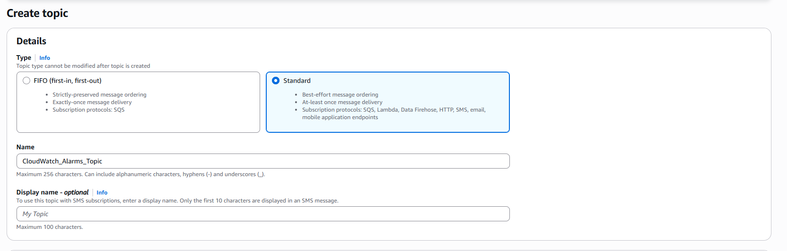

-  **1.3** เปิดกล่องข้อความในอีเมลส่วนตัวของคุณ จะพบบทความหัวข้อ *AWS Notification - Subscription Confirmation* ให้กดปุ่ม **Confirm subscription** เพื่อเปิดใช้งานช่องทางรับข่าวสารอย่างเป็นทางการ

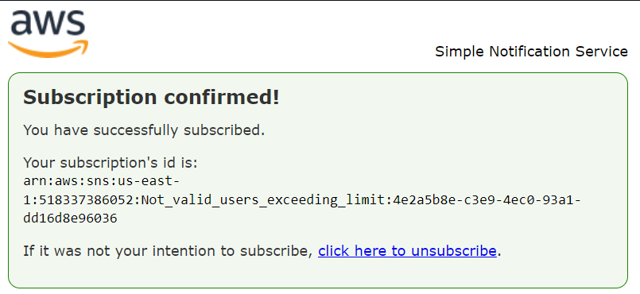

  

#### 2. การเปิดกลุ่มเก็บบันทึกเหตุการณ์ (CloudWatch Log Group)

-  **2.1** ไปที่บริการ Amazon CloudWatch เลือกเมนูย่อย Log groups

-  **2.2** ค้นหากลุ่มบันทึกเหตุการณ์ที่ระบบจำลองสร้างไว้สำหรับเชื่อมต่อกับประวัติการสั่งงาน โดยปกติจะตั้งชื่อในลักษณะใกล้เคียงกับ `CloudTrail/CloudWatchLogGroup`

-  **2.3** คลิกเข้าไปตรวจสอบด้านใน จะพบรายการสตรีมข้อมูล (Log Streams) ที่หลั่งไหลเข้ามาจากระบบ CloudTrail ตลอดเวลา ซึ่งระบุละเอียดว่าใคร ทำอะไร ที่ไหน เมื่อไหร่ บนระบบคลาวด์

  

#### 3. สร้างตัวกรองตรวจจับการพยายามแอบเจาะระบบ (Metric Filter - Unauthorized Attempts)

เนื่องจากฝ่ายความปลอดภัยต้องการทราบว่ามีใครพยายามส่งคำสั่งที่ไม่มีสิทธิ์ใช้งาน (Access Denied) หรือไม่ เราจึงต้องเขียนเงื่อนไขตัวกรองดักจับ:

1. ในหน้า Log Group ข้างต้น เลือกแถบ **Metric filters** แล้วกดสร้าง (Create metric filter)

2. ใส่รหัสคำค้นหาตัวกรอง (Filter pattern) เพื่อดักจับข้อผิดพลาดการถูกปฏิเสธสิทธิ์การเข้าถึง

3. ตั้งชื่อตัวกรองว่า `UnauthorizedAttemptsFilter` และกำหนดชื่อค่าชี้วัด (Metric name) ว่า `UnauthorizedAttemptsMetric` โดยให้ระบบนับแต้มเพิ่มทีละ 1 ทุกครั้งที่มีประวัติเหตุการณ์ตรงกับเงื่อนไขนี้

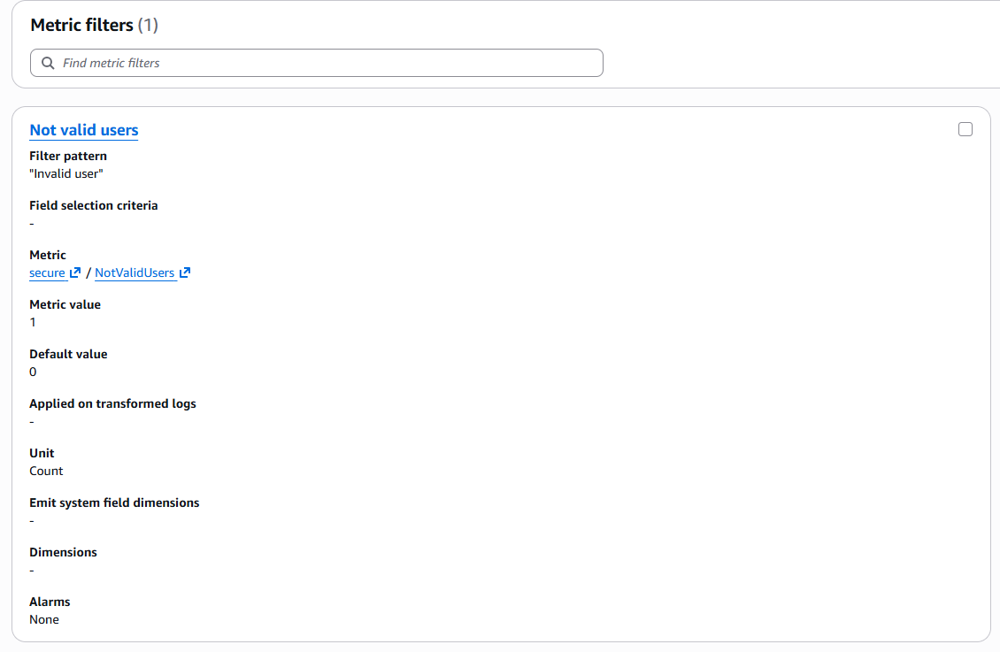

  

#### 4. ผูกระบบสั่งยิงสัญญาณเตือนภัยเมื่อพบสิ่งผิดปกติ (CloudWatch Alarm)

1. คลิกที่ตัวเลือกสร้างสัญญาณเตือนภัย (Create alarm) จากค่าชี้วัด `UnauthorizedAttemptsMetric` ที่เพิ่งสร้างขึ้น

2. ตั้งค่าเงื่อนไขการเตือนภัย (Conditions):

-  **Threshold type:** Static

-  **Whenever UnauthorizedAttemptsMetric is...:** เลือกเป็น Greater than (>) และใส่เลข `0` (หมายความว่า หากมีการสั่งงานแล้วโดนปฏิเสธสิทธิ์แม้เพียงครั้งเดียวในรอบ 1 นาที ให้ระบบตื่นตัวทันที)

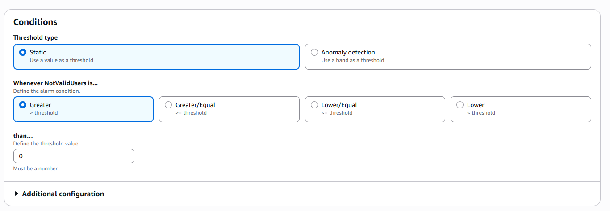

3. ในขั้นตอนการกำหนดพฤติกรรม (Actions):

- เลือกสถานะเป็น **In alarm**

- ตรงส่วนการส่งข้อเสนอแนะ ให้เลือกผูกเข้ากับ SNS Topic `CloudWatch_Alarms_Topic` ที่เตรียมไว้ในขั้นตอนแรก จากนั้นตั้งชื่อเตือนภัยนี้ว่า `Unauthorized_Attempts_Alarm` แล้วกดบันทึกสร้าง

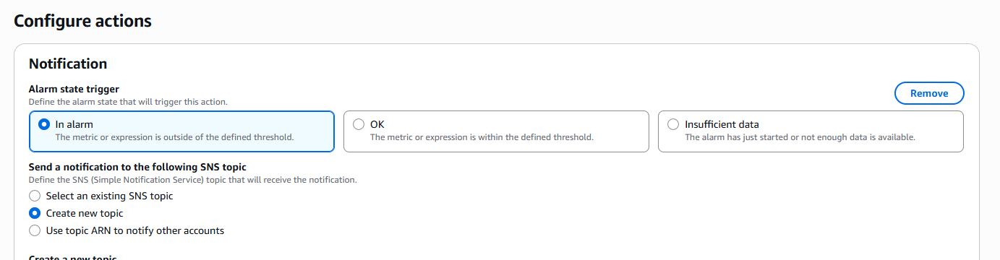

  

### Conclusion & Future Work

**Key Takeaways**

-  **การเฝ้าระวังแบบเชิงรุก (Proactive Security Monitoring):** เปลี่ยนมุมมองจากการรอให้ระบบโดนแฮกแล้วค่อยตามแก้ มาเป็นการวางกับดักสัญญานเตือนภัยล่วงหน้า ทำให้ระงับเหตุได้ทันท่วงทีก่อนความเสียหายจะขยายวงกว้าง

-  **เบื้องหลังกลไกการส่งต่อข้อมูล (Log Pipeline):** คือการที่เราเริ่มจากการตั้งกล้องวงจรปิดที่ **"แหล่งกำเนิด" (CloudTrail)** -> ส่งภาพทั้งหมดไปคัดกรองที่ **"โกดังเก็บข้อมูล" (CloudWatch)** -> หากเจอคนร้ายก็ให้ **"ตัวตัดสินใจ" (Alarm)** เป็นคนฟันธงความผิดปกติ -> และส่งไม้ต่อให้ **"กระบอกเสียง" (SNS)** กระจายข่าวสารให้เรารู้ตัว... นี่แหละครับคือศิลปะของการสร้าง Data Pipeline ที่ทำให้ระบบ Security ทำงานแทนเราได้ตลอด 24 ชั่วโมง!

  

**Real-world Application & Examples**

-  **ตัวอย่างการใช้งานจริง:** การตรวจจับการเจาะระบบรหัสผ่าน (Brute-Force Attack Detection) ในโลกการทำงานจริง สามารถนำ Pattern นี้ไปประยุกต์ใช้ตรวจสอบการลงชื่อเข้าใช้งานคอนโซลบริหารจัดการ หากพบว่ามีบัญชีใดบัญชีหนึ่งลงชื่อเข้าใช้ผิดพลาดติดต่อกันเกิน 5 ครั้งภายใน 2 นาที (ConsoleLogin Failure) ให้ระบบส่งสัญญาณเตือนภัยไปยังผู้ถือรหัสทันที เพราะอาจมีผู้ไม่หวังดีกำลังสุ่มเดารหัสผ่านอยู่